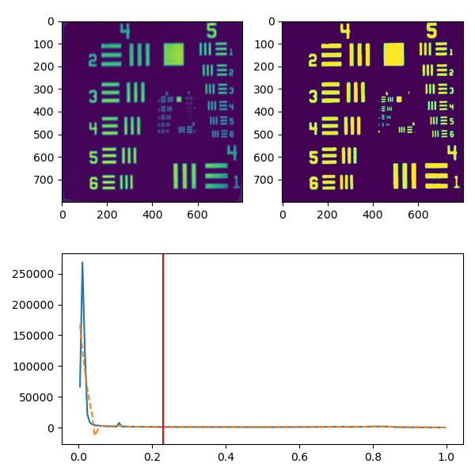
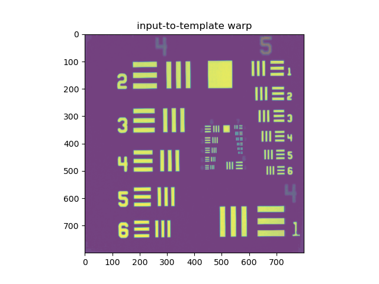
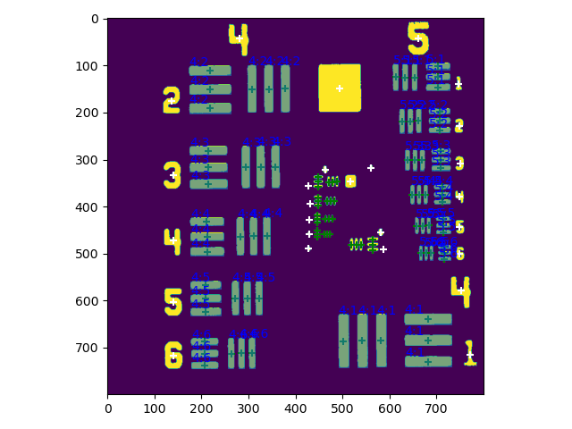
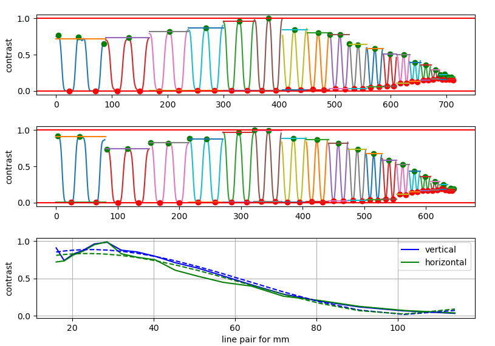

# usaf1951
USAF1951 analyze scripts and MTF computation

## usage

1. Load USAF1951 template information (information about groups and element are stored as colors on image, see usaf1951_tmpl.png)
```python
import numpy as np; ar = np.array
from skimage import io
import usaf_measure

template = io.imread('USAF1951_template.png')

template = template[:,:,:3] #drop alpha channel
template[((template!=[255,255,255]) & (template!=[0,0,0])).nonzero()[:2]] += ar([0, 40, 0], dtype=np.uint8)
template[((template!=[255,255,255]) & (template!=[0,0,0])).nonzero()[:2]] //= ar([100, 10, 10], dtype=np.uint8)
```

2. Binarization of input image (choose threshold parameter)



3. Match  template to input as affine transform matrix

```python
# rough mathcing using rectangle match
initial_warp_matrix = usaf_measure.find_initial_transform_by_rectangles(input_b, template)

# exact matching
warp_matrix, template_warp = usaf_measure.warp_coeffs_to_template(\
    input, template, plot=True, \
    initial_warp_matrix = initial_warp_matrix)
```


4. Measure resolution
```python
horiz_res, vert_res = usaf_measure.measure_resolution(
                            input_b, warp_matrix, template,
                             min_measure_group = 4,
                             max_measure_group = 5, plot=True)

px2um = 1 / ar([np.mean(horiz_res), np.mean(vert_res)])

print ('horiz res = %.6f +/- %.6f [px/um]' % (1/np.mean(horiz_res), np.std(1/ar(horiz_res))))
print ('vert  res = %.6f +/- %.6f [px/um]' % (1/np.mean(vert_res),  np.std(1/ar(horiz_res))))
print ("size = %.3f x %.3f [um]" % tuple(ar(input.shape) * px2um))

focal_size = 20
px2deg = np.rad2deg( 2 * np.arctan( px2um/100/2/focal_size) )
print ("size = %.3f x %.3f [deg]" % tuple(ar(input.shape) * px2deg))
```
output:
```
horiz res = 1.390488 +/- 0.005709 [px/um]
vert  res = 1.555811 +/- 0.005709 [px/um]
size = 1112.391 x 1244.649 [um]
size = 31.868 x 35.657 [deg]
```



6. MTF
```python
lppermm, contrasts = usaf_measure.MTF(input, warp_matrix, template, margin = 0.1, plot=True)
```

